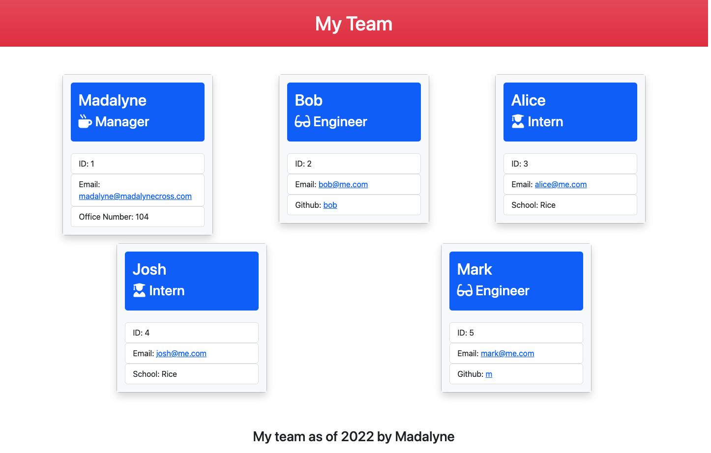

  # profile-my-team

  

  ## Description 
  Node application that builds a website of my team with information including email addresses and id numbers

  ## Table of Contents
  * [Installation](#installation)
  * [Usage](#usage)
  * [Tests](#tests)
  * [Questions](#questions)
  
  ## Installation
  ~~~
  npm i
  ~~~

  ## Usage
  Make sure to get the dependancies by running ```npm i```. Then to run the program, run ```node index```. 

  Look for your completed html file in the dist folder.

  To see the application demonstrated, watch the [walkthrough video](https://watch.screencastify.com/v/MClkEChxXAf2cuItagpH).
  
  Here is an example of the completed html file:
  


  ## Tests
  ~~~
  npm test
  ~~~
  
  ## Questions

  Contact me at madalyne@madalynecross.com with any questions. View more of my work here: [violanerd](https://github.com/violanerd).

